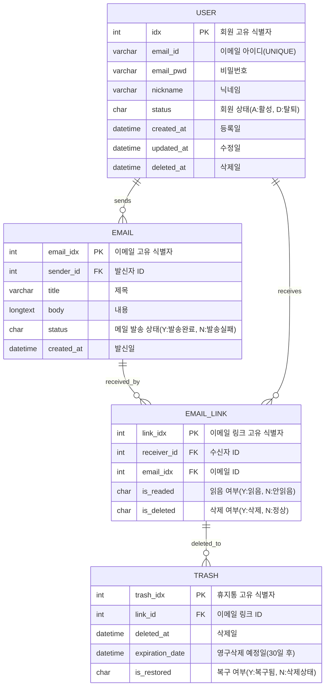
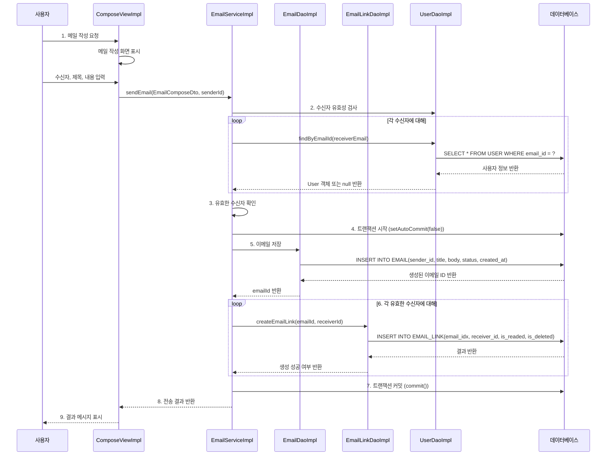
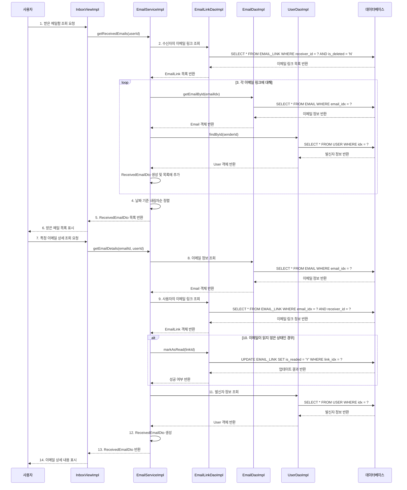
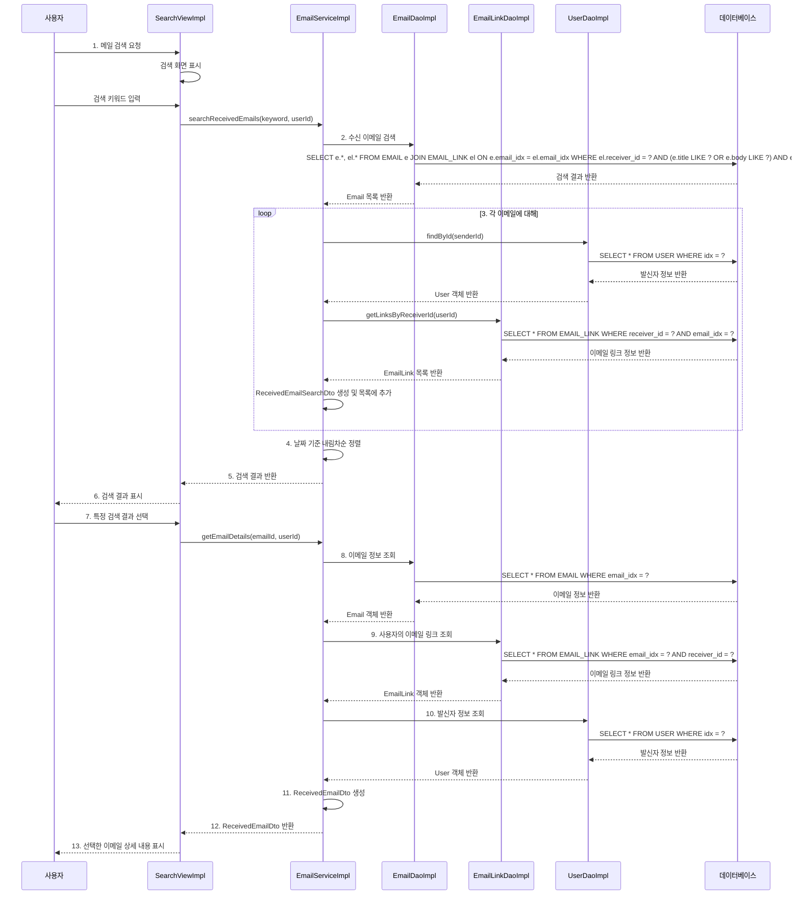

# 이메일 관리 시스템 (콘솔 기반)
JDBC를 활용한 콘솔 기반 이메일 관리 시스템입니다.

## 프로젝트 목표
이 프로젝트는 JDBC를 활용하여 데이터베이스와 상호작용하는 콘솔 기반 이메일 관리 시스템을 구현합니다.
주요 기능으로 회원 관리, 이메일 작성/읽기/검색, 휴지통 관리 등이 있습니다.

## 개발 환경

- Java 17 (Eclipse Temurin 17.0.14)
- MySQL 8.4
- JDBC

## 기능 요약

### 사용자 관리

- 로그인
- 회원가입
- 프로필 수정
- 회원 탈퇴


### 이메일 기능

- 이메일 작성 및 전송
- 받은 메일함 조회
- 보낸 메일함 조회
- 이메일 검색
- 휴지통 관리


## 개발자 역할 분담

- 개발자 A (우선): 로그인/회원가입, 회원수정 메뉴
- 개발자 B (유진): 메일작성, 받은메일함, 메일검색 메뉴
- 개발자 C (효민): 보낸메일함, 휴지통 메뉴

## 설치 및 실행 방법

### 프로젝트 클론
```bash
git clone https://github.com/choe-yujin/email-management-system.git
```

### 데이터베이스 설정
- MySQL 서버에서 sql/schema.sql 스크립트를 실행하여 필요한 테이블을 생성합니다.
- sql/sample_data.sql 스크립트를 실행하여 테스트 데이터를 로드합니다.
```bash
mysql -u root -p < sql/schema.sql
mysql -u root -p < sql/sample_data.sql
```

### 환경 설정
- resources 에 config.properties 파일을 생성 후 아래 내용을 작성합니다.
```java
- db.url=jdbc:mysql://localhost:3306/MAIL_SYSTEM
- db.username = 이름
- db.password = 비밀번호
```

### 프로젝트 컴파일 및 실행

```bash
javac -d bin src/**/*.java
java -cp bin com.metaverse.mail.Application
```

## 테이블 구조

- USER: 사용자 정보 관리
- EMAIL: 이메일 기본 정보
- EMAIL_LINK: 이메일과 수신자 연결 정보
- TRASH: 휴지통 관리

## 개발 가이드
- [Git 및 GitHub 사용 가이드](./GIT_GUIDE.md)

### 브랜치 전략

- main: 최종 배포 브랜치
- develop: 개발 통합 브랜치

### 기능별 브랜치:
```
- main           # 최종 제출용 안정 버전
|
+-- develop      # 개발 통합 브랜치
    |
    +-- feature/user       # 개발자 A(우선님) 작업 브랜치
    |   |
    |   +-- feature/user/login
    |   +-- feature/user/register
    |   +-- feature/user/profile
    |
    +-- feature/mail       # 개발자 B(유진님) 작업 브랜치
    |   |
    |   +-- feature/mail/compose
    |   +-- feature/mail/inbox
    |   +-- feature/mail/search
    |
    +-- feature/inbox      # 개발자 C(효민님) 작업 브랜치
        |
        +-- feature/inbox/sent
        +-- feature/inbox/trash
```

### 커밋 메시지 규칙

- 기능 추가: feat: 기능 설명
- 버그 수정: fix: 버그 설명
- 리팩토링: refactor: 내용
- 문서 수정: docs: 내용

## 코딩 스타일 가이드

- 모든 클래스와 메서드에 적절한 주석을 작성합니다.
- 변수와 메서드 명은 camelCase를 사용합니다.
- 클래스 명은 PascalCase를 사용합니다.
- 상수는 모두 대문자로 작성하고 단어 사이는 언더스코어(_)로 구분합니다.


## 프로젝트 구조
```plantuml
com.metaverse.mail/
├── Application.java              # 프로그램 진입점
│
├── common/                       # 공통 유틸리티
│   ├── JDBCConnection.java       # DB 연결 관리
│   ├── Constants.java            # 상수
│   ├── QueryUtil.java            # SQL 쿼리 유틸리티
│   ├── Session.java              # 로그인 세션 관리
│   └── ConsoleHelper.java        # 콘솔 UI 공통 기능
│
├── model/                        # 기본 모델 클래스
│   ├── User.java                 # 사용자 모델
│   ├── Email.java                # 이메일 모델
│   ├── EmailLink.java            # 이메일 링크 모델
│   └── Trash.java                # 휴지통 모델
│
├── dto/                          # 데이터 전송 객체 (DTO)
│   ├── user/                     # 개발자 A(우선님) 담당
│   │   ├── UserLoginDto.java     # 로그인 입출력 DTO
│   │   ├── UserRegisterDto.java  # 회원가입 입력 DTO
│   │   └── UserProfileDto.java   # 회원정보 DTO
│   │
│   ├── mail/                           # 개발자 B(유진님) 담당
│   │   ├── EmailComposeDto.java        # 메일 작성 DTO
│   │   ├── ReceivedEmailDto.java       # 받은 메일 DTO
│   │   ├── EmailSearchDto.java         # 이메일 검색 결과 DTO
│   │   ├── ReceivedEmailSearchDto.java # 수신 이메일 검색 결과 DTO
│   │   ├── SnetEmailSearchDto.java     # 발신 이메일 검색 결과 DTO
│   │   └── EmailSearchDto.java         # 메일 검색 DTO
│   │
│   └── inbox/                    # 개발자 C(효민님) 담당
│       ├── SentEmailDto.java     # 보낸 메일 DTO
│       └── TrashEmailDto.java    # 휴지통 DTO
│
├── dao/                          # 데이터 액세스 객체 (DAO)
│   ├── interfaces/               # DAO 인터페이스
│   │   ├── UserDao.java
│   │   ├── EmailDao.java
│   │   ├── EmailLinkDao.java
│   │   └── TrashDao.java
│   │
│   └── impl/                     # DAO 구현체
│       ├── user/                 # 개발자 A 담당
│       │   └── UserDaoImpl.java 
│       │
│       ├── mail/                 # 개발자 B 담당
│       │   └── EmailDaoImpl.java
│       │
│       └── inbox/                # 개발자 C 담당
│           ├── EmailLinkDaoImpl.java
│           └── TrashDaoImpl.java
│
├── service/                      # 비즈니스 로직
│   ├── interfaces/               # 서비스 인터페이스
│   │   ├── UserService.java
│   │   ├── EmailService.java
│   │   ├── InboxService.java
│   │   └── TrashService.java
│   │
│   └── impl/                     # 서비스 구현체
│       ├── user/                 # 개발자 A 담당
│       │   └── UserServiceImpl.java
│       │
│       ├── mail/                 # 개발자 B 담당
│       │   └── EmailServiceImpl.java
│       │
│       └── inbox/                # 개발자 C 담당
│           ├── InboxServiceImpl.java
│           └── TrashServiceImpl.java
│
├── view/                         # 사용자 인터페이스
│   ├── interfaces/               # View 인터페이스
│   │   ├── MainMenuView.java     # 메인 메뉴 인터페이스(공통)
│   │   │
│   │   ├── user/                 # 사용자 관련 인터페이스
│   │   │   ├── LoginView.java    # 로그인 화면 인터페이스
│   │   │   ├── RegisterView.java # 회원가입 화면 인터페이스
│   │   │   └── ProfileView.java  # 프로필 관리 화면 인터페이스
│   │   │
│   │   ├── mail/                 # 메일 관련 인터페이스
│   │   │   ├── ComposeView.java  # 메일 작성 화면 인터페이스
│   │   │   ├── InboxView.java    # 받은 메일함 화면 인터페이스
│   │   │   └── SearchView.java   # 메일 검색 화면 인터페이스
│   │   │
│   │   └── inbox/                # 보낸메일/휴지통 관련 인터페이스
│   │       ├── SentMailView.java # 보낸 메일함 화면 인터페이스
│   │       └── TrashView.java    # 휴지통 화면 인터페이스
│   │
│   └── impl/                     # View 구현체
│       ├── MainMenuViewImpl.java # 메인 메뉴 (공통)
│       │
│       ├── user/                 # 개발자 A 담당
│       │   ├── LoginViewImpl.java
│       │   ├── RegisterViewImpl.java
│       │   └── ProfileViewImpl.java
│       │
│       ├── mail/                 # 개발자 B 담당
│       │   ├── ComposeViewImpl.java
│       │   ├── InboxViewImpl.java
│       │   ├── ReplyViewImpl.java
│       │   └── SearchViewImpl.java
│       │
│       └── inbox/                # 개발자 C 담당
│           ├── SentMailViewImpl.java
│           └── TrashViewImpl.java
```


## 다이어그램

### 데이터베이스 ER 다이어그램



### 시퀀스 다이어그램(이메일 작성 및 전송 과정)


### 시퀀스 다이어그램(받은 메일함을 조회하는 과정)


### 시퀀스 다이어그램(메일을 검색하는 과정)
